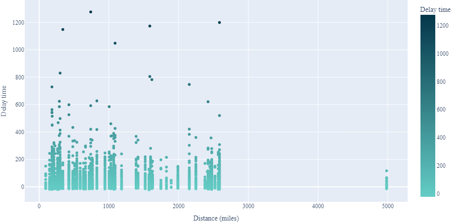
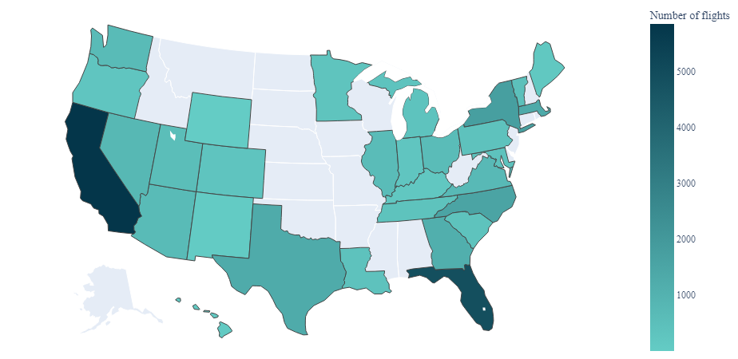
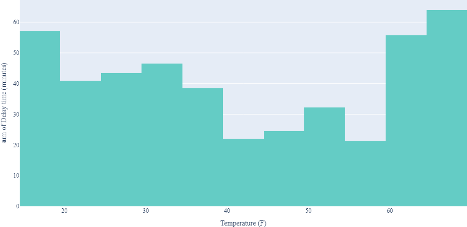
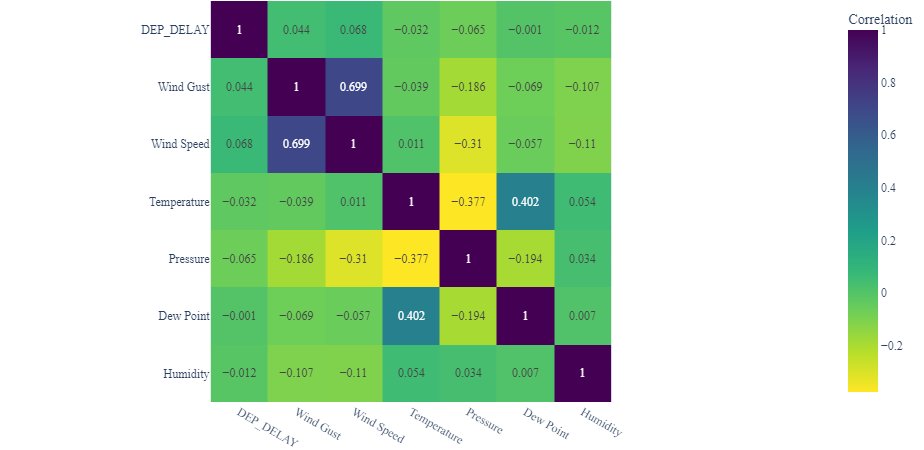
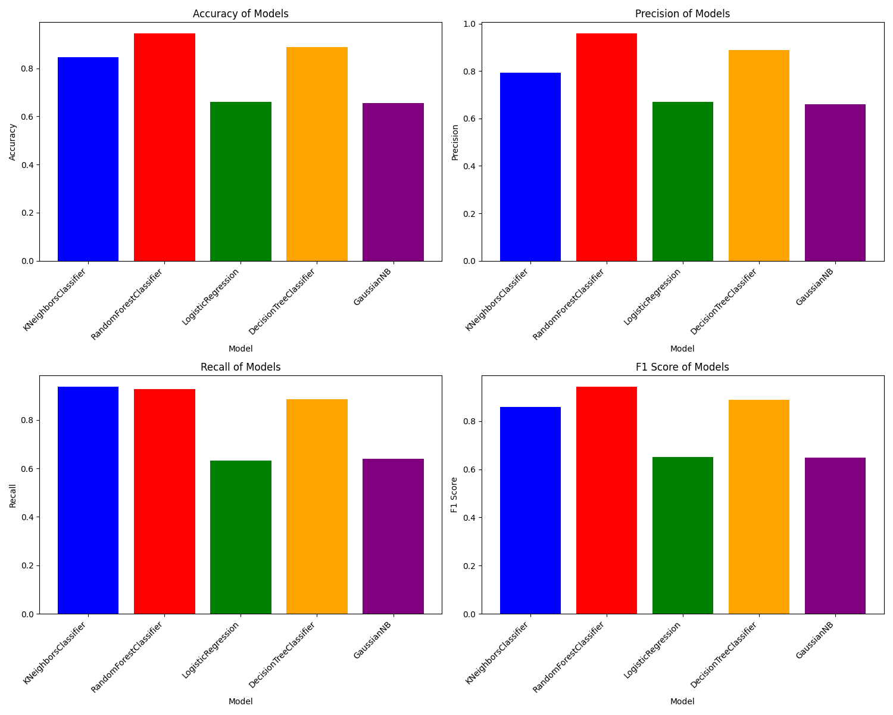
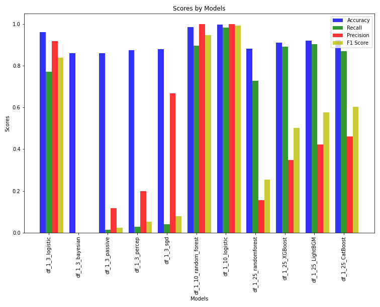
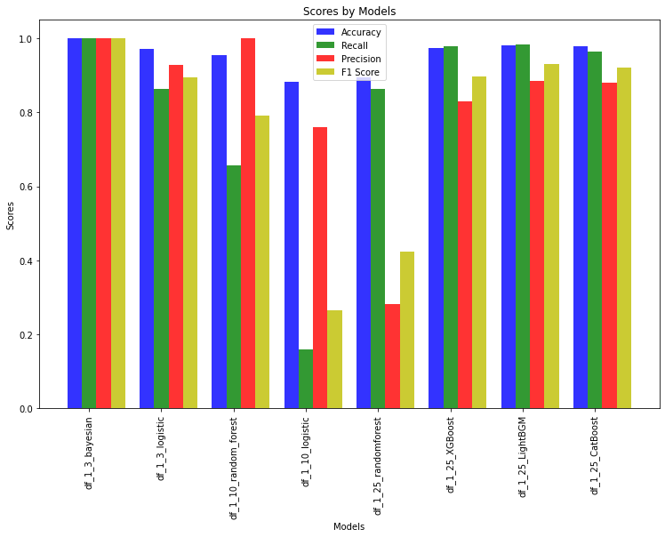
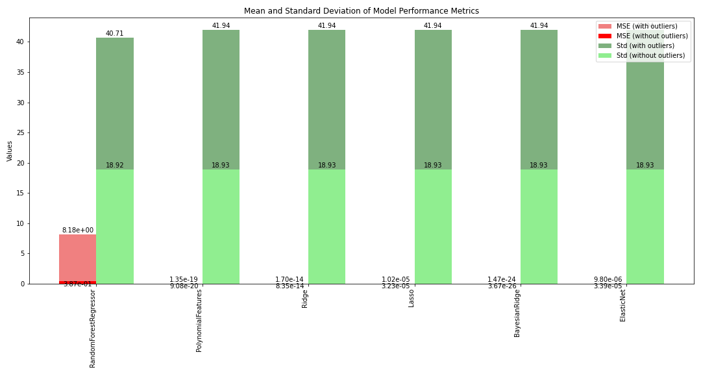

# Delayma: A Comprehensive Approach to Accurate Flight Delay Forecasting

### Authors:
- [Anirudh S. Kumar](https://github.com/Anirudh-S-Kumar)
- [Prakhar Gupta](https://github.com/Prakhar-Gupta-03)
- [Sahil Saraswat](https://github.com/sahilence)
- [Vartika](https://github.com/Vartika2401)

## Motivation
Flight delays have long been a centre of uncertainty in the aviation industry, having widespread effects on the aviation industry and passengers.It is a critical concern within the aviation industry, impacting passenger satisfaction, operational costs, and overall system efficiency. Prediction of delay can have far-reaching consequences on the entire industry and is of huge economic importance. 

Accurately predicting flight delays is a crucial point of research as it is affected by various factors-weather, air traffic congestion, logistic complexities, festivities, and economics. Developing reliable prediction models can revolutionize how airlines manage their schedules and passengers plan their journeys. This study aimed at creating a modern ML model which can accurately predict delays based on- season, time, location, etc. For this study, we used various datasets and intend to employ relevant ML algorithms to correctly predict delays. 

## Related Work

Several attempts have been made before to predict flight delays.

- **Jia Yi and team**[^1] have attempted a classifier with a delay defined as the arrival or departure being 15 minutes later than scheduled. They've implemented a stacking algorithm with two layers. The first-level learners include KNN, Random Forest, Logistic Regression, Decision Tree, and Gaussian Naive Bayes. The second-level learner is a Logistic Regression model. Yi uses the Boruta algorithm for feature selection. The stacking algorithm outperformed any single-level learner in terms of scores (accuracy, precision, recall, and F1 score). Random forest classifiers came close to the stacking algorithm compared to the rest of the algorithms. Their classification achieved an accuracy of 0.82 for the stacking algorithm.

- **Esmaeilzadeh and Mokhtarimousavi**[^2] attempted to employ Support Vector Machines to explore the non-linear relationship between flight delay outcomes. They considered only 20 days in 2018 at three major New York City airports. According to their findings, factors such as pushback delay, taxi-out delay, ground delay program, and demand-capacity imbalance with probabilities of 0.506, 0.478, 0.339, and 0.338 are significantly associated with flight departure delay.

- **Zhang and Ma**[^3] have attempted multi-classification of departure delay with three classes: less than 15, between 15 and 60 minutes, and greater than 60 minutes. They merged the flight dataset with a weather dataset and had 260k samples in their dataset. Features were selected manually. They performed the CatBoost algorithm, which uses gradient boosting on decision trees. The learning is implemented on the GPU, while the scoring algorithm runs on the CPU. The model achieved 0.77 accuracy.

- **Tang**[^4] attempted binary classification with a flight being classified as delayed if the departure was 15 minutes later than scheduled. The data was taken for JFK Airport during November 2019 and December 2020. They performed tenfold cross-validation for Logistic Regression, KNN, Gaussian Naïve Bayes, Decision Trees, SVM, Random Forest, Gradient Boosted Trees from scikit-learn with default parameters. Decision Trees performed the best with 0.977 accuracy, followed by gradient-boosted Trees.

[^1]: Yi et al., [Link to Paper](citation_link_1)
[^2]: Esmaeilzadeh and Mokhtarimousavi, [Link to Paper](citation_link_2)
[^3]: Zhang and Ma, [Link to Paper](citation_link_3)
[^4]: Tang, [Link to Paper](citation_link_4)

## Dataset Details
The dataset source is from [this kaggle dataset](https://www.kaggle.com/datasets/threnjen/2019-airline-delays-and-cancellations), which contains information about flights that took off from JFK Airport between November 2019 and January 2020.

### Insights from the dataset
- Apart from a few outliers, distance doesn't seem to have a strong correlation with delay.

- If we look at the most common destination states, they are California, Florida, and New York. This is not surprising as these are the most populous states in the US. Surprisingly, the two most common destinations are in California, which is on the other side of the country. 

- Extreme weather condition, like very high temperature and very low temperature, can cause flight delays. This makes sense as extreme weather conditions can cause problems with the aircraft and the airport.

 - Even though earlier we stated that there may be some correlation between temperature and delay, the correlation is not very strong. In fact, the correlation between and any weather condition and delay is not very strong. 
  

### How we used the dataset
Datasets used for Classification had their `DEP_DELAY` column converted to binary classes based on delay, where delay is true if the departure time delay exceeds 15 minutes.

To simplify the classification problem we decided to begin with the smaller problem and then proceed to the bigger one. To proceed, four sub-datasets were created from this.
- **df_1_3** - Dataset with top 3 most frequent destinations.
- **df_1_10** - Dataset with top 10 most frequent destinations.
- **df_1_25** - Dataset with top 25 most frequent destinations.
- **df_preprocessed** - Dataset with all destinations.

For the regression problem, the `DEP_DELAY` column was used as it is.
- **m1_final_regression_dataset** - Dataset with all destinations for regression.

## Data Pre-processing
Basic preprocessing, which was done on the complete dataset:

1. The feature `Condition` initially had 25 different conditions. In some data points, the `Condition` field had more than one condition. First, we performed an encoding similar to label encoding in a monotonically increasing way. For example, there were different kinds of cloudy, such as 'mostly cloudy' and 'partly cloudy', for which we gave numbers 2 and 1, respectively. Each feature was given one column, which resulted in 9 new columns and the deletion of the `Condition` column.

2. Parameters like day, month, hour, and minute are repetitive. Cyclic feature engineering is required on such cyclic parameters, where we represent one parameter on a circle, with all the points on the circle showing its periodic properties. Therefore, cyclic feature engineering was done on columns `MONTH`, `DAY_OF_WEEK`, `DAY_OF_MONTH`.

To simplify the problem, we decided to begin with the smaller problem and then proceed to the bigger one. To proceed, four sub-datasets were created from this.

Datasets used for Classification had their `DEP_DELAY` column converted to binary classes based on delay, where delay is true if the departure time delay exceeds 15 minutes.

| Feature                    | Format   | Description                                  |
|-----------------------------|----------|----------------------------------------------|
| MONTH                       | int64    | month                                        |
| DAY_OF_MONTH                | int64    | date on which flight departed                |
| DAY_OF_WEEK                 | int64    | day number of the week on which flight departed |
| OP_UNIQUE_CARRIER           | object   | Carrier Code                                 |
| TAIL_NUM                    | object   | Airflight Number                             |
| DEST                        | object   | Destination                                  |
| DEP_DELAY                   | float64  | Departure delay of the flight                |
| CRS_ELAPSED_TIME            | int64    | Scheduled journey time of the flight         |
| DISTANCE                    | int64    | Distance of the flight                       |
| CRS_DEP_M                   | int64    | Scheduled Departure Time                     |
| CRS_ARR_M                   | int64    | Scheduled Arrival Time                       |
| Temperature                 | int64    | Temperature                                  |
| Dew Point                   | object   | Dew Point                                    |
| Humidity                    | int64    | Humidity                                    |
| Wind                        | object   | Wind type                                    |
| Wind Speed                  | int64    | Wind speed                                   |
| Wind Gust                   | int64    | Wind Gust                                    |
| Pressure                    | float64  | Pressure                                    |
| Condition                   | object   | Condition of the climate                     |
| sch_dep                     | int64    | No. of flights scheduled for arrival         |
| sch_arr                     | int64    | No. of flights scheduled for departure       |
| TAXI_OUT                    | int64    | Taxi-out time                                |
| Cloudy                      | int64    | Cloudy intensity                            |
| Windy                       | int64    | Windy intensity                             |
| Fair                        | int64    | Fair intensity                              |
| Rain                        | int64    | Rain intensity                              |
| Fog                         | int64    | Fog intensity                               |
| Drizzle                     | int64    | Drizzle intensity                           |
| Snow                        | int64    | Snow intensity                              |
| Wintry Mix                  | int64    | Wintry Mix intensity                        |
| Freezing Rain               | int64    | Freezing Rain intensity                     |
| MONTH_sin                   | float64  | Sin value of month                          |
| MONTH_cos                   | float64  | Cos value of month                          |
| DAY_OF_MONTH_sin            | float64  | Sin value of day of month                   |
| DAY_OF_MONTH_cos            | float64  | Cos value of day of month                   |
| DAY_OF_WEEK_sin             | float64  | Sin value of day of the week                 |
| DAY_OF_WEEK_cos             | float64  | Cos value of day of the week                 |

The columns `MONTH`, `DAY_OF_MONTH`, `DAY_OF_WEEK` were converted to sin and cos values to make them cyclic. The columns `Temperature`, `Dew Point`, `Wind`, `Condition` were converted to numerical values. The columns `Cloudy`, `Windy`, `Fair`, `Rain`, `Fog`, `Drizzle`, `Snow`, `Wintry Mix`, `Freezing Rain` were added in the dataset after preprocessing and `MONTH`, `DAY_OF_MONTH`, `DAY_OF_WEEK`, and `Condition` were dropped from the dataset.## Methodology
### Baseline for classification
We have reproduced results from the papers and used the algorithms they have used in the papers to set a baseline from the previous studies. On our preprocessed data, we now use the Synthetic Minority Oversampling Technique(SMOTE), which uses KNN as its hidden layer algorithm to synthesize samples of minority classes to deal with the class imbalance(quite severe in our dataset). After we've dealt with class imbalance, we perform an 80:20 split and scale the data. Following this, we use the Boruta algorithm to select features, a complex algorithm involving Random Forests to automate feature selection. Random forest model produced the best scores given below:

### Classification 
We used mutiple algorithms for multiple datasets and compared their performance.
| Dataset      | Algorithm                      | Hyperparameters                                             |
|--------------|--------------------------------|-------------------------------------------------------------|
| df_1_3       | Logistic Regression             | Penalty = l2, Tolerance = 1e-05, Max Iterations = 500, Solver = lbfgs |
|              | Bayesian Classifier             | Alpha = 0.1                                                 |
|              | Passive Aggressive Classifier   | Default                                                     |
|              | SGD Classifier                 | Default                                                     |
| df_1_10      | Logistic Regression             | C = 0.01, max_iter = 1000                                   |
|              | Random Forest Classifier        | max_depth = 4, max_features = 'log2', n_estimators = 100   |
| df_1_25      | Random Forest Classifier        | n_estimators = 400                                           |
|              | XGBoost Classifier              | colsample_bytree = 1.0, gamma = 0, max_depth = 5, min_child_weight = 5, subsample = 1 |
|              | LightGBM Classifier             | num_leaves = 100                                            |
|              | CatBoost Classifier             | depth = 5, iterations = 1000, learning_rate = 0.1           |

The models were evaluated using key metrics such as Accuracy, Precision, Recall, and F1-Score.

### Regression

After getting more that 97% accuracy in classification, we moved on to regression. We did regression on the entire dataset.

We initially used the following algorithms and did hyperparameter tuning on them without removing outliers:

| Model                   | Hyperparameters                            | MSE               | Standard Deviation | R2 Score         |
|-------------------------|--------------------------------------------|-------------------|--------------------|------------------|
| RandomForestRegressor  | max_depth=5, n_estimators=10, random_state=1 | 8.181139821257709 | 40.70694805649899  | 0.9953494499785353 |
| LogisticRegression      | max_iter=1000                               | 238.81002775850104| 35.144905132310484 | 0.1696738376127689 |
| PolynomialFeatures      |                                            | 1.3481809385058682e-19 | 41.94254194735039 | 1.0              |
| Ridge                   | alpha=0.1                                   | 1.7009984245916603e-14 | 41.942541819448124 | 1.0              |
| Lasso                   | alpha=0.1                                   | 1.0151470431585268e-05 | 41.939918134838756 | 0.9999999942294201 |
| BayesianRidge           |                                            | 1.4721718996060103e-24 | 41.9425419472715  | 1.0              |
| ElasticNet              | alpha=0.1                                   | 9.800489179465707e-06 | 41.93953594682402 | 0.9999999944289346 |

As we can see, we are successfully getting a low MSE and high R2 score. However, the standard deviation is very high. This is because of the outliers in the dataset. We removed the outliers and got the following results:
We removed out the outliers using z-score with threshold 3.0. We got the following results:

| Model                   | Hyperparameters                            | MSE               | Standard Deviation | R2 Score         |
|-------------------------|--------------------------------------------|-------------------|--------------------|------------------|
| RandomForestRegressor  | max_depth=5, n_estimators=10, random_state=1 | 0.38696657430406917 | 18.92251379576839  | 0.9989203147691209 |
| LogisticRegression      | max_iter=1000                               | 43.66264333132167 | 16.903501399081502 | 0.19251659625829812 |
| PolynomialFeatures      |                                            | 9.07804542408821e-20 | 18.931636018258537 | 1.0              |
| Ridge                   | alpha=0.1                                   | 8.345072074179379e-14 | 18.93163573579082 | 0.9999999999999998 |
| Lasso                   | alpha=0.1                                   | 3.234717961771208e-05 | 18.925994878347524 | 0.9999999097473157 |
| BayesianRidge           |                                            | 3.670305072093405e-26 | 18.931636018178416 | 1.0              |
| ElasticNet              | alpha=0.1                                   | 3.3872517697929823e-05 | 18.925947405132025 | 0.9999999054914313 |

We can see that the standard deviation has decreased significantly. Only Logistic Regression has a high standard deviation. This is because Logistic Regression is not a good model for regression. We can see that the MSE has also decreased significantly. We can also see that the R2 score has increased significantly. This is because the outliers were affecting the R2 score. We can see that the R2 score is now very close to 1.0. This means that the model is performing very well.

## Results
The result using multiple algorithms for multiple datasets are as follows:

Logistic regression seemeed to be a consistent model throughout all the different datasets, achieving almost 100% accuracy.

We trained the model on complete train set using these algorithms with same hyperparameters as were used in the other datasets, and got the following results:

The labels in the graph above represent which model was used to train the complete train set.

Here is the comparison of the results of the algorithms with default parameters on the complete train set before and after removing outliers:

## Conclusion and Future Work
We conclude that we are able to get a very highly tuned model of bayesian ridge regression for getting nearly predictions for flight delays. We can use this model to predict flight delays and take necessary actions to prevent them. These models can be tested on larger datasets with real-time data. This will be a more complicated challenging task as updating and extracting real time data, which is more prone to having incomplete information and thus multiple empty fields. We can also use these models to predict flight delays and inform the passengers about the delay in advance. This will help the passengers to plan their journey accordingly.

## References

